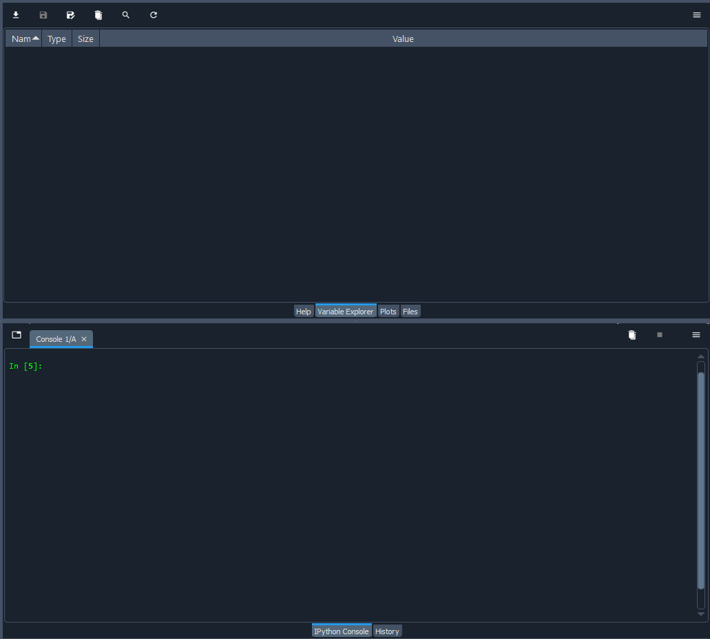

# Distance-based Unsupervised Clustering

[Source paper][paper_link]

[paper_link]: https://www.sciencedirect.com/science/article/pii/S1755581721001747

Sabbagh, R.; Zivkovi ́c, S.; Gawlik, B.; Sreenivasan, S.; Stothert, A.; Majstorovic, V.;
Djurdjanovic, D. Organization of big metrology data within the Cyber-Physical Manufacturing Metrology Model (CPM3). CIRP Journal of Manufacturing Science and
Technology 2022, 36, 90–99.
- [Distance-based Unsupervised Clustering](#distance-based-unsupervised-clustering)
  - [Section1: Overview](#section1-overview)
  - [Section2: Algorithm introduction and Code structure](#section2-algorithm-introduction-and-code-structure)
    - [Unsupervised Clustering Algorithm](#unsupervised-clustering-algorithm)
    - [Code structure](#code-structure)
  - [Section3: Dependencies and Tutorial](#section3-dependencies-and-tutorial)
    - [Dependencies](#dependencies)
  - [Section4: Version update history](#section4-version-update-history)


## Section1: Overview
We propose a novel data curation concept that enables data mining and analytics within the recently described Cyber-Physical Manufacturing Metrology Model (CPM3). The newly proposed methodology is based on organizing the metrology data into tree-based database structures using distance-based unsupervised clustering of the raw metrology data. 

We implemented an unsupervised clustering algorithm by hyper-spectral data in this code file. The algorithm can effectively classify the hyper-dimensional attributes from data, and we select two features for the progress visualization.


## Section2: Algorithm introduction and Code structure
### Unsupervised Clustering Algorithm


The flowchart of our algorithm implementation is described above. 
1. We initially input the raw data in the matrix form with rows representing samples and columns representing hyperdimensional parameters.
2. Initialization of the centroids of the  first batch input by given methodologies: (i) KNN (ii) Farthest (Default setting: initial centroids number:3, max centroids numbers:10)
3. Adjust centroids until reaching the acceptable tolerance.
4. Detect if there are any abnormal outliers within the current clustering. If so, a new centroid will be added to the current centroids based on its neighboring cluster.
5. Add another new batch, and keep iterating through Step2-4.

### Code structure


## Section3: Dependencies and Tutorial

### Dependencies
```
matplotlib==3.5.1
matplotlib-base==3.5.1
matplotlib-inline==0.1.3
numpy==1.21.5
numpy-base==1.21.5
numpydoc==1.3.1
pandas==1.4.2
scikit-learn==1.0.2
seaborn==0.11.2
```

1. Execute `main_manual_input.py`
2. Input:
   
    (1). File (.csv) format: (without row/column names)
    
    m >> n
    
    |        | Hyper-dimension-1_values | Hyper-dimension-2_values | …   | Hyper-dimension-n_values |
    | ------ | ------------------------ | ------------------------ | --- | ------------------------ |
    | data1  | Numbers                  | Numbers                  | …   | Numbers                  |
    | data2  | Numbers                  | Numbers                  | …   | Numbers                  |
    | data3  | Numbers                  | Numbers                  | …   | Numbers                  |
    | …      | Numbers                  | Numbers                  | …   | Numbers                  |
    | data_m | Numbers                  | Numbers                  | …   | Numbers                  |

    
    (2). Maximized centroids #: Enter `10` for our example testing
    
   

## Section4: Version update history
| Date  | Task                          | Version |
| ----- | ----------------------------- | ------- |
| 05/12 | Fundamental framewrk complete | 1.0.0   |